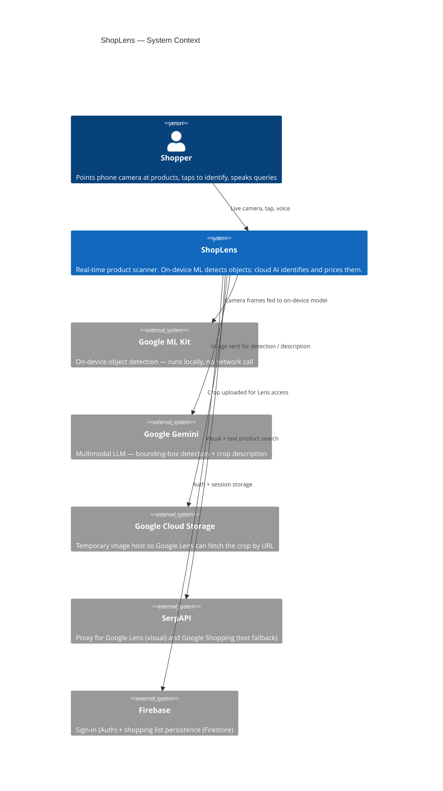

# C1 — System Context

Shows ShopLens as a black box in relation to the people who use it and the external systems it depends on.

## Key points

- **ML Kit is on-device** — no network hop, zero added latency for the live glow overlay
- **GCS is a relay** — images are uploaded only so Lens has a public URL to fetch from; a 1-day bucket lifecycle rule deletes them automatically
- **SerpAPI wraps both Lens and Shopping** — one key, two search modes (visual first, text fallback)
- **Firebase is used only for identity and persistence** — it plays no role in the product-identification pipeline
