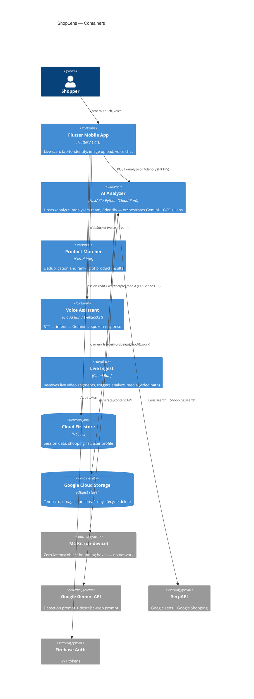

# C2 — Container

Shows the deployable units (containers) inside ShopLens and how they communicate.

## Key points

- **AI Analyzer is the bottleneck** — it owns the Gemini, GCS, and Lens calls; all latency tuning targets this container
- **ML Kit lives entirely inside the mobile app** — the Analyzer never calls it; the mobile app passes the resulting crop as `image_data`
- **Live Ingest uses the same `analyze_media()` function** as the image path, but on GCS video URIs — Lens is skipped for video
- **Product Matcher and Voice Assistant are separate Cloud Run services** — they are not part of the tap-to-identify or scan-all paths
