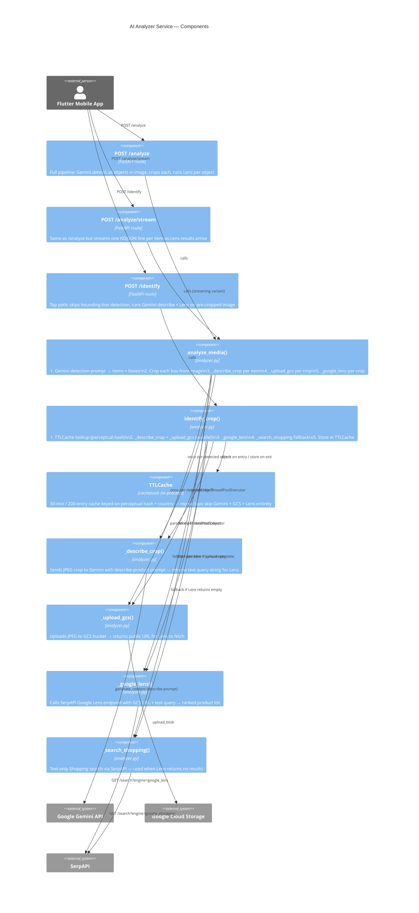

# C3 — Component (AI Analyzer internals)

Shows the internal components of the AI Analyzer service and how they connect to each other and to external systems.

## Key points

- **`/identify` vs `/analyze` difference**: `/identify` skips Gemini bounding-box detection (the crop arrives pre-made from ML Kit); `/analyze` runs Gemini on the full image first to find objects, then crops each one
- **Gemini is still called by `/identify`** — `_describe_crop` sends the crop to Gemini for a rich text description (color, material, brand) that improves Lens query quality; only the detection pass is skipped
- **TTLCache only guards `/identify`** — `/analyze` (Scan All) has no cache; repeat Scan All presses re-run everything
- **`_describe_crop` and `_upload_gcs` run in parallel** inside `identify_crop` via a `ThreadPoolExecutor(max_workers=2)` — the upload does not wait for the description to finish
- **Shopping fallback is text-only** — it only fires when Lens returns zero results; it uses the Gemini-generated description text as the query
