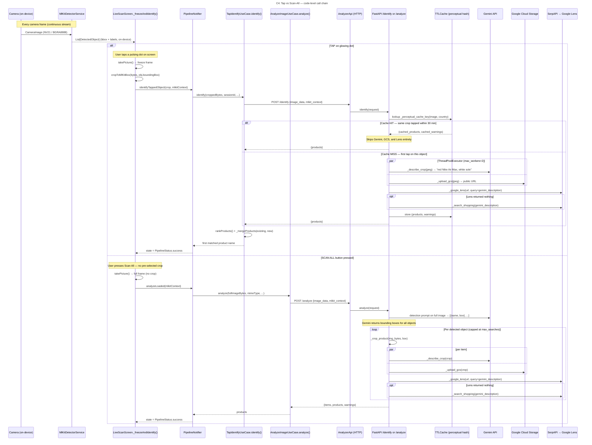

# C4 — Code: Tap vs Scan-All call chain

Shows the exact code-level call sequence for both live-scan paths, from camera frame to displayed product results.

## Gemini call count comparison

| Path | Gemini calls | GCS uploads | Lens calls |
|------|:---:|:---:|:---:|
| **Tap (cache miss)** | 1 (describe crop) | 1 | 1 |
| **Tap (cache hit)** | 0 | 0 | 0 |
| **Scan All (N objects detected)** | 1 (detection) + N (describe per crop) | N | N |

## File locations

| Step | File |
|------|------|
| Camera frame → ML Kit | `mobile/lib/core/services/mlkit_detector_service.dart` |
| Bounding box overlay + tap handler | `mobile/lib/presentation/widgets/object_glow_overlay.dart` |
| Freeze, crop, route decision | `mobile/lib/presentation/screens/live_scan_screen.dart` |
| State machine + use-case dispatch | `mobile/lib/presentation/providers/pipeline_provider.dart` |
| Tap use-case (calls /identify) | `mobile/lib/domain/usecases/tap_identify_usecase.dart` |
| Analyze use-case (calls /analyze) | `mobile/lib/domain/usecases/analyze_image_usecase.dart` |
| HTTP client | `mobile/lib/data/sources/remote/analyzer_api.dart` |
| FastAPI routes | `services/ai-analyzer/main.py` |
| identify_crop / analyze_media | `services/ai-analyzer/analyzer.py` |
