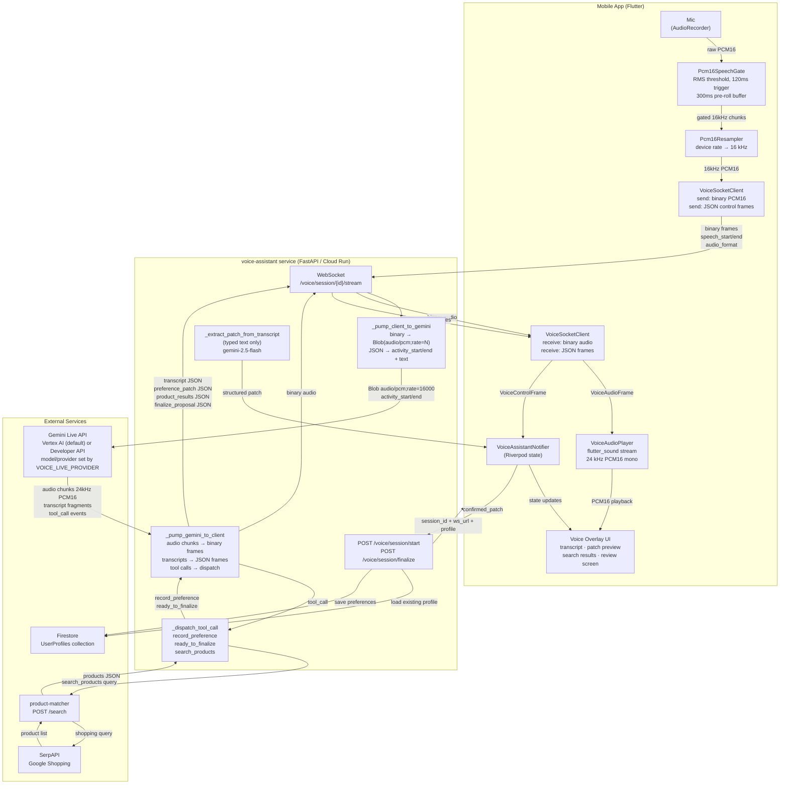
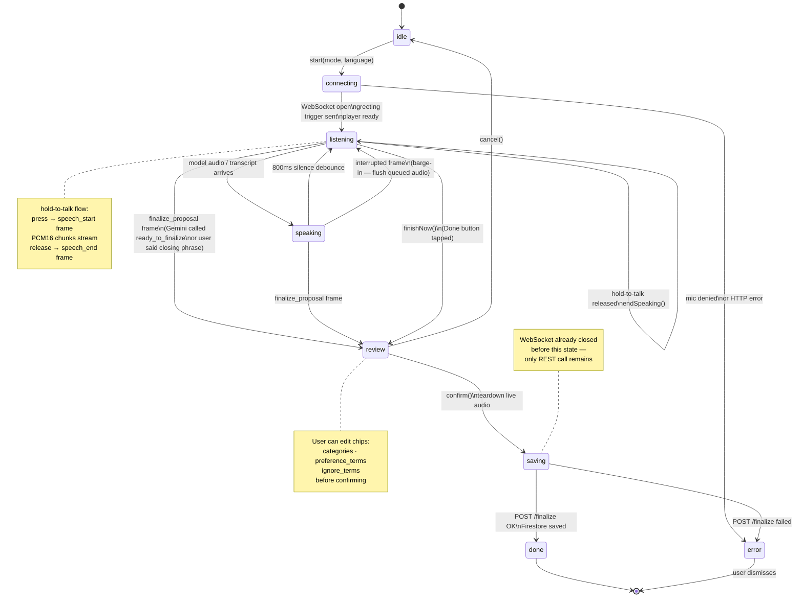
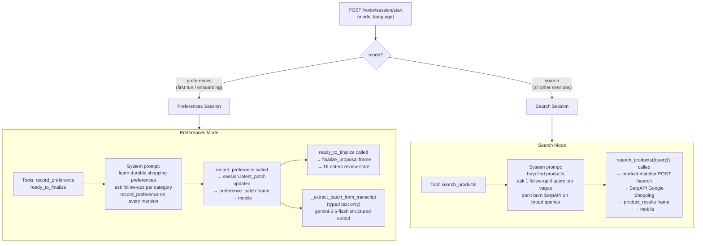
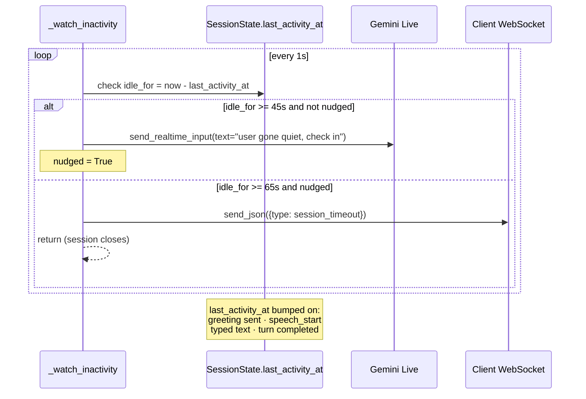
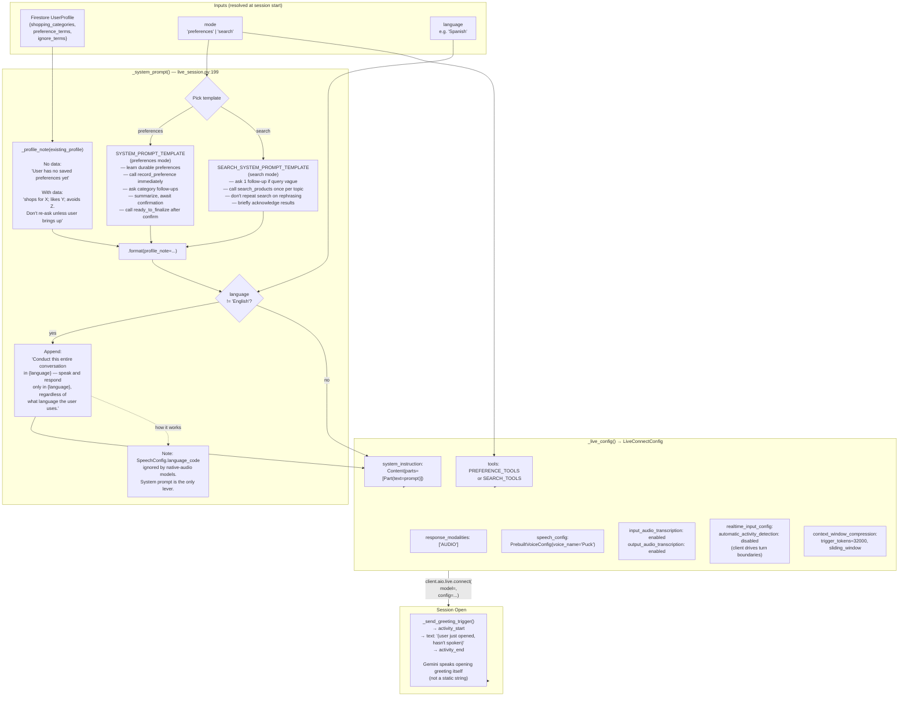
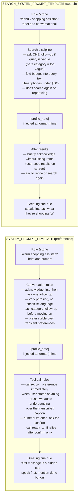
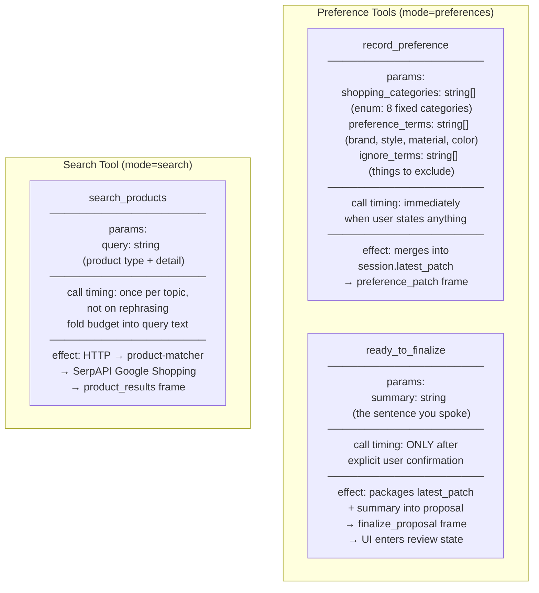

# Voice Assistant — Architecture Diagrams

Three diagrams covering different views of the voice assistant system:
- [Data Flow](#data-flow) — what moves between which components
- [Control Flow](#control-flow) — session lifecycle and state transitions
- [Prompt Flow](#prompt-flow) — how the Gemini system prompt is assembled

**Scope note:** these diagrams cover the WS-proxy transport only (the one live in production
today). They predate the direct-connect transport (mobile talking straight to Gemini Live via an
ephemeral token) and the `VOICE_LIVE_PROVIDER` model switch — see
[voice-assistant-websocket-transport.md](../explainer/voice-assistant-websocket-transport.md) for
that architecture, including its own mermaid diagram covering both transports.

---

## Data Flow

End-to-end movement of audio, control frames, tool calls, and persistence.

---

## Control Flow

Session lifecycle, mode branching, and UI state transitions.

### Mode Branching

### Inactivity Watchdog

---

## Prompt Flow

How the Gemini Live system prompt is assembled from runtime data.

### Prompt Templates — Annotated

---

### Tool Definitions Summary

