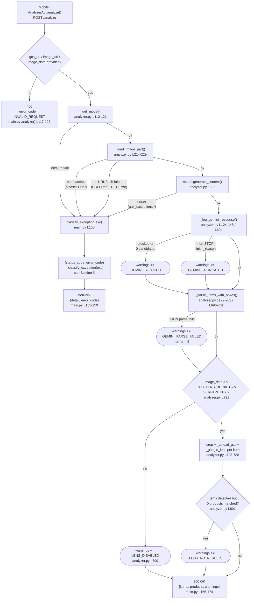
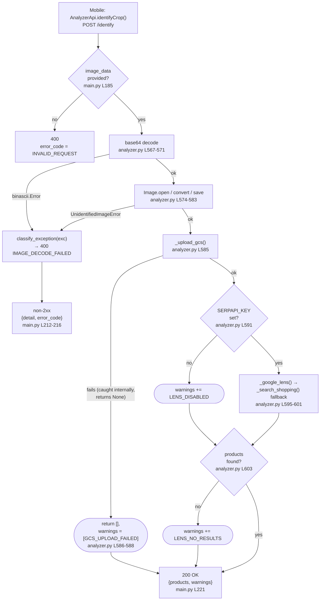
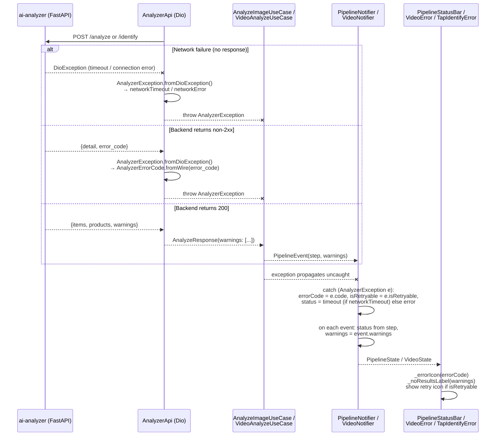

# AI Analyzer — Error Handling Guide

**Scope:** `services/ai-analyzer` (`/analyze`, `/identify`) and the mobile error-handling pipeline that consumes it.
**Branch:** `feature/error-log`
**Last updated:** 2026-06-10

---

## Contents

1. [Two-tier error model](#1-two-tier-error-model)
2. [End-to-end flow — `/analyze`](#2-end-to-end-flow--analyze)
3. [End-to-end flow — `/identify`](#3-end-to-end-flow--identify)
4. [Mobile error propagation (sequence diagram)](#4-mobile-error-propagation)
5. [`classify_exception()` reference — hard errors](#5-classify_exception-reference--hard-errors)
6. [Soft-failure warning codes](#6-soft-failure-warning-codes)
7. [Stage-by-stage origin map](#7-stage-by-stage-origin-map)
8. [Mobile-side code reference](#8-mobile-side-code-reference)
9. [Debugging with request IDs](#9-debugging-with-request-ids)
10. [File map](#10-file-map)

---

## 1. Two-tier error model

| Tier | Trigger | Response shape | HTTP status | Mobile handling |
|---|---|---|---|---|
| **Hard error** | An exception escapes `analyze_media()` / `identify_crop()`, or request validation fails | `{"detail": "...", "error_code": "..."}` | Non-2xx (400/429/500/502/503/504) | `Dio` throws → `AnalyzerException` → `PipelineState`/`VideoState` enters an **error** (or **timeout**) state |
| **Soft warning** | The call *succeeds* but something degraded along the way (Gemini blocked, Lens disabled/empty, parse failure, etc.) | `{"items": [...], "products": [...], "warnings": ["..."]}` | 200 OK | `PipelineEvent.warnings` → `PipelineState.warnings` → `PipelineStatusBar` shows a friendlier "no results" message |

Hard errors mean **the request failed** — nothing usable came back. Soft warnings mean **the request succeeded** but the `items`/`products` arrays may be empty (or smaller than expected) and the UI should explain why instead of just saying "no products found".

---

## 2. End-to-end flow — `/analyze`

This covers the **image path** (the one the mobile app uses). The `gcs_video_uri` branch in `analyze_media()` is a parallel, simpler path (no Lens, only `GEMINI_BLOCKED`/`GEMINI_TRUNCATED`/`GEMINI_PARSE_FAILED` are possible) kept for the pub/sub video-ingestion pipeline — it is **not** invoked by the current mobile UI.

---

## 3. End-to-end flow — `/identify`

`/identify` is the "tap-to-identify" path: it skips Gemini entirely and sends a manually cropped image straight to GCS → Google Lens.

> Note: `_upload_gcs()`, `_google_lens()`, and `_search_shopping()` all swallow their own exceptions and return `None`/`[]` — they **never** propagate. The only exceptions that can escape `identify_crop()` (and therefore reach `classify_exception`) are the base64 decode and image re-encode steps.

---

## 4. Mobile error propagation

---

## 5. `classify_exception()` reference — hard errors

[`analyzer.py:86-105`](../services/ai-analyzer/analyzer.py#L86-L105) maps any exception raised from `analyze_media()` / `identify_crop()` to `(http_status_code, error_code)`. Both `/analyze` and `/identify` call it identically (`main.py:150`, `main.py:207`).

| Exception type | HTTP status | `error_code` | Typical cause |
|---|---|---|---|
| `gax_exceptions.ResourceExhausted` | 429 | `GEMINI_QUOTA_EXCEEDED` | Vertex AI / Gemini quota or rate limit hit |
| `gax_exceptions.ServiceUnavailable` | 503 | `GEMINI_UNAVAILABLE` | Gemini backend temporarily down |
| `gax_exceptions.DeadlineExceeded`, `gax_exceptions.RetryError` | 504 | `GEMINI_TIMEOUT` | Gemini call took too long / exhausted retries |
| `gax_exceptions.PermissionDenied`, `gax_exceptions.Unauthenticated` | 500 | `GEMINI_AUTH_ERROR` | Bad/missing service-account credentials, wrong project |
| `gax_exceptions.InvalidArgument`, `gax_exceptions.FailedPrecondition` | 400 | `GEMINI_INVALID_INPUT` | Malformed prompt/media sent to Gemini |
| `gax_exceptions.GoogleAPICallError` (anything else) | 502 | `GEMINI_ERROR` | Any other Vertex AI API error |
| `PIL.UnidentifiedImageError`, `binascii.Error` | 400 | `IMAGE_DECODE_FAILED` | `image_data` is not valid base64 / not a decodable image |
| `urllib.error.URLError`, `urllib.error.HTTPError` | 400 | `IMAGE_FETCH_FAILED` | `image_url` could not be fetched (404, DNS, timeout, etc.) |
| Anything else | 500 | `INTERNAL_ERROR` | Unclassified bug — check the request-id'd stack trace |

In addition, two app-wide handlers cover everything outside the `try`/`except` blocks of `/analyze` and `/identify`:

| Handler | `error_code` | HTTP status | Fires when |
|---|---|---|---|
| `_unhandled` ([`main.py:53-63`](../services/ai-analyzer/main.py#L53-L63)) | `INTERNAL_ERROR` | 500 | Any uncaught `Exception` anywhere in the app (e.g. malformed Pydantic body, a bug outside the analyze/identify try-blocks) |
| `_http` ([`main.py:66-72`](../services/ai-analyzer/main.py#L66-L72)) | `REQUEST_ERROR` | (original status) | Any `HTTPException` raised explicitly |
| Request validation ([`main.py:117-123`](../services/ai-analyzer/main.py#L117-L123), [`main.py:185-191`](../services/ai-analyzer/main.py#L185-L191)) | `INVALID_REQUEST` | 400 | `/analyze` missing `gcs_uri`/`image_url`/`image_data`, or `/identify` missing `image_data` |

---

## 6. Soft-failure warning codes

These appear in the `warnings: string[]` array on a **200 OK** response. The request succeeded; `items`/`products` may simply be smaller (or empty) than expected.

| Code | Emitted from | Meaning |
|---|---|---|
| `GEMINI_BLOCKED` | `_log_gemini_response()` ([`analyzer.py:124-148`](../services/ai-analyzer/analyzer.py#L124-L148)) | Gemini's safety filters blocked the prompt (`prompt_feedback.block_reason`), or it returned 0 candidates |
| `GEMINI_TRUNCATED` | `_log_gemini_response()` | A candidate's `finish_reason` was not `STOP` (e.g. hit `MAX_TOKENS`) |
| `GEMINI_PARSE_FAILED` | `analyze_media()`, around `_parse_items_with_boxes()` ([`analyzer.py:696-701`](../services/ai-analyzer/analyzer.py#L696-L701) / [`L658-663`](../services/ai-analyzer/analyzer.py#L658-L663)) | Gemini's response text was not valid JSON — `items_raw` defaults to `[]` |
| `LENS_DISABLED` | `analyze_media()` else-branch ([`analyzer.py:790-799`](../services/ai-analyzer/analyzer.py#L790-L799)) or `identify_crop()` ([`analyzer.py:591-592`](../services/ai-analyzer/analyzer.py#L591-L592)) | Lens stage skipped — missing `image_data`, `GCS_LENS_BUCKET`, and/or `SERPAPI_KEY` env vars |
| `LENS_NO_RESULTS` | `analyze_media()` ([`analyzer.py:801-802`](../services/ai-analyzer/analyzer.py#L801-L802)) or `identify_crop()` ([`analyzer.py:603-604`](../services/ai-analyzer/analyzer.py#L603-L604)) | Lens (and the Shopping-search fallback, for `/identify`) ran but matched 0 products |
| `GCS_UPLOAD_FAILED` | `identify_crop()` ([`analyzer.py:586-588`](../services/ai-analyzer/analyzer.py#L586-L588)) | Uploading the cropped image to GCS failed — Lens never ran, `products = []` |

Notes:
- `GEMINI_BLOCKED` and `GEMINI_TRUNCATED` are mutually exclusive per call (the first one detected wins — `_log_gemini_response` only sets `warning_code` if not already set).
- `LENS_NO_RESULTS` is only added if `LENS_DISABLED` wasn't already added — they describe two different reasons for the same symptom (no products), so only one is reported.
- `GCS_UPLOAD_FAILED` short-circuits `identify_crop()` — `LENS_DISABLED`/`LENS_NO_RESULTS` cannot also appear in the same response.

---

## 7. Stage-by-stage origin map

### `/analyze` (image path)

| # | Stage | Function : line | Possible outcomes |
|---|---|---|---|
| 1 | Request validation | `main.py` `analyze()` [L117-123](../services/ai-analyzer/main.py#L117-L123) | `400 INVALID_REQUEST` if none of `gcs_uri`/`image_url`/`image_data` set |
| 2 | Model init | `_get_model()` [L110-121](../services/ai-analyzer/analyzer.py#L110-L121) | `vertexai.init`/`GenerativeModel` failure → usually `500 INTERNAL_ERROR` (or `GEMINI_AUTH_ERROR` if a GAX auth exception is raised) |
| 3 | Image loading | `_load_image_part()` [L214-229](../services/ai-analyzer/analyzer.py#L214-L229), called at [L673-677](../services/ai-analyzer/analyzer.py#L673-L677) | `image_data` bad base64 → `400 IMAGE_DECODE_FAILED`; `image_url` fetch fails → `400 IMAGE_FETCH_FAILED`; (defensive-only) neither set → `500 INTERNAL_ERROR` |
| 4 | Gemini call | `model.generate_content()` [L686](../services/ai-analyzer/analyzer.py#L686) | Any `gax_exceptions.*` → mapped per Section 5 (429/503/504/500/400/502) |
| 5 | Gemini response diagnostics | `_log_gemini_response()` [L694](../services/ai-analyzer/analyzer.py#L694) → [L124-148](../services/ai-analyzer/analyzer.py#L124-L148) | `warnings += GEMINI_BLOCKED` (safety block / 0 candidates) or `warnings += GEMINI_TRUNCATED` (non-STOP finish reason) |
| 6 | Item parsing | `_parse_items_with_boxes()` [L696-701](../services/ai-analyzer/analyzer.py#L696-L701) | JSON parse failure → `warnings += GEMINI_PARSE_FAILED`, `items = []` |
| 7 | Lens gating | `analyze_media()` [L721](../services/ai-analyzer/analyzer.py#L721), else-branch [L790-799](../services/ai-analyzer/analyzer.py#L790-L799) | If `image_data`/`GCS_LENS_BUCKET`/`SERPAPI_KEY` missing → `warnings += LENS_DISABLED`, `products = []` |
| 8 | Lens / cropping | `_crop_product()`, `_upload_gcs()`, `_google_lens()` per item [L728-788](../services/ai-analyzer/analyzer.py#L728-L788) | Per-item failures are logged and that item simply contributes 0 products — no top-level error/warning |
| 9 | Post-Lens check | `analyze_media()` [L801-802](../services/ai-analyzer/analyzer.py#L801-L802) | If items were detected but `products` is still empty (and Lens wasn't already disabled) → `warnings += LENS_NO_RESULTS` |
| 10 | Response | `main.py` `analyze()` [L165-174](../services/ai-analyzer/main.py#L165-L174) (success) / [L148-159](../services/ai-analyzer/main.py#L148-L159) (exception → `classify_exception`) | `200 {items, products, warnings}` or non-2xx `{detail, error_code}` |

### `/identify`

| # | Stage | Function : line | Possible outcomes |
|---|---|---|---|
| 1 | Request validation | `main.py` `identify()` [L185-191](../services/ai-analyzer/main.py#L185-L191) | `400 INVALID_REQUEST` if `image_data` missing |
| 2 | Base64 decode | `identify_crop()` [L567-571](../services/ai-analyzer/analyzer.py#L567-L571) | `binascii.Error` → `400 IMAGE_DECODE_FAILED` |
| 3 | Image re-encode (force JPEG) | `identify_crop()` [L574-583](../services/ai-analyzer/analyzer.py#L574-L583) | `UnidentifiedImageError` → `400 IMAGE_DECODE_FAILED` |
| 4 | GCS upload | `_upload_gcs()` [L585](../services/ai-analyzer/analyzer.py#L585) → [L257-276](../services/ai-analyzer/analyzer.py#L257-L276) | Internally caught; on failure `identify_crop()` short-circuits → `200 {products: [], warnings: [GCS_UPLOAD_FAILED]}` |
| 5 | Lens gating | `identify_crop()` [L591-592](../services/ai-analyzer/analyzer.py#L591-L592) | `SERPAPI_KEY` unset → `warnings += LENS_DISABLED` |
| 6 | Lens + Shopping fallback | `_google_lens()` / `_search_shopping()` [L595-601](../services/ai-analyzer/analyzer.py#L595-L601) | Both internally caught — never raise; return `[]` on failure |
| 7 | Post-Lens check | `identify_crop()` [L603-604](../services/ai-analyzer/analyzer.py#L603-L604) | `products` still empty (and not already `LENS_DISABLED`) → `warnings += LENS_NO_RESULTS` |
| 8 | Response | `main.py` `identify()` [L218-231](../services/ai-analyzer/main.py#L218-L231) (success/serialization) / [L205-216](../services/ai-analyzer/main.py#L205-L216) (exception → `classify_exception`) | `200 {items: [], products, warnings}` or non-2xx `{detail, error_code}`. If JSON serialization of `products` itself fails, falls back to `200 {products: [], warnings}` (products silently dropped, no error_code) |

---

## 8. Mobile-side code reference

### 8.1 `AnalyzerErrorCode.fromWire()` — backend `error_code` → enum

[`analyzer_error.dart:20-33`](../mobile/lib/data/models/analyzer_error.dart#L20-L33)

| Wire `error_code` | `AnalyzerErrorCode` |
|---|---|
| `INVALID_REQUEST` | `invalidRequest` |
| `IMAGE_DECODE_FAILED` | `imageDecodeFailed` |
| `IMAGE_FETCH_FAILED` | `imageFetchFailed` |
| `GEMINI_QUOTA_EXCEEDED` | `geminiQuotaExceeded` |
| `GEMINI_UNAVAILABLE` | `geminiUnavailable` |
| `GEMINI_TIMEOUT` | `geminiTimeout` |
| `GEMINI_AUTH_ERROR` | `geminiAuthError` |
| `GEMINI_INVALID_INPUT` | `geminiInvalidInput` |
| `GEMINI_ERROR` | `geminiError` |
| `INTERNAL_ERROR` | `internalError` |
| `REQUEST_ERROR` | `requestError` |
| *(anything else, or no response received)* | `unknown` |

### 8.2 Mobile-only codes — never sent by the backend

[`AnalyzerException.fromDioException()`](../mobile/lib/data/models/analyzer_error.dart#L50-L76) assigns these **before** a response body even exists, based on `DioExceptionType`:

| `DioExceptionType` | `AnalyzerErrorCode` |
|---|---|
| `connectionTimeout`, `sendTimeout`, `receiveTimeout` | `networkTimeout` |
| `connectionError` | `networkError` |

### 8.3 `displayMessage` / `isRetryable`

[`analyzer_error.dart:80-101`](../mobile/lib/data/models/analyzer_error.dart#L80-L101)

| `AnalyzerErrorCode` | `displayMessage` | `isRetryable` |
|---|---|---|
| `geminiQuotaExceeded` | "Our AI is busy right now — please try again in a minute." | ✅ |
| `geminiUnavailable` | "The AI service is temporarily unavailable — please try again shortly." | ✅ |
| `geminiTimeout` | "That took too long to process — please try again." | ✅ |
| `networkTimeout` | (the message set in `fromDioException`: "Taking longer than usual — try again in a moment!") | ✅ |
| `networkError` | (the message set in `fromDioException`: "Could not reach the server — check your connection and try again.") | ✅ |
| `geminiAuthError` | "The AI service is misconfigured — please contact support." | ❌ |
| `imageFetchFailed` | "Could not load that image — please try a different one." | ❌ |
| `imageDecodeFailed` | "That image couldn't be read — please try a different photo." | ❌ |
| everything else (`invalidRequest`, `geminiInvalidInput`, `geminiError`, `internalError`, `requestError`, `unknown`) | "Something went wrong — please try again." | ❌ |

### 8.4 Where each piece is consumed

| Component | File | What it does with errors/warnings |
|---|---|---|
| `AnalyzerApi.analyze()` / `.identifyCrop()` | [`analyzer_api.dart:13-30`](../mobile/lib/data/sources/remote/analyzer_api.dart#L13-L30) | Wraps `DioException` → `AnalyzerException.fromDioException(e)` |
| `PipelineEvent` | [`analyze_image_usecase.dart:17-22`](../mobile/lib/domain/usecases/analyze_image_usecase.dart#L17-L22) | Carries `warnings` alongside each `PipelineStep`; only populated on the terminal `done` event ([L69](../mobile/lib/domain/usecases/analyze_image_usecase.dart#L69)) |
| `PipelineNotifier.analyzeImage()` | [`pipeline_provider.dart:56-96`](../mobile/lib/presentation/providers/pipeline_provider.dart#L56-L96) | On `AnalyzerException`: sets `errorCode`, `isRetryable`, `errorMessage = e.displayMessage`, and `status = timeout` (if `networkTimeout`) else `error`. On each `PipelineEvent`: maps `status` from `step` and copies `warnings` |
| `PipelineStatusBar` | [`pipeline_status_bar.dart`](../mobile/lib/presentation/widgets/pipeline_status_bar.dart) | `_errorIcon(errorCode)` picks an icon ([L94-101](../mobile/lib/presentation/widgets/pipeline_status_bar.dart#L94-L101)); `_noResultsLabel(warnings)` picks a "no results" message for `GEMINI_BLOCKED`/`GEMINI_PARSE_FAILED`/`GEMINI_TRUNCATED` vs. the generic case ([L105-113](../mobile/lib/presentation/widgets/pipeline_status_bar.dart#L105-L113)); shows a refresh icon when `isRetryable` ([L85-88](../mobile/lib/presentation/widgets/pipeline_status_bar.dart#L85-L88)) |
| `VideoNotifier` | [`video_provider.dart:118-121`](../mobile/lib/presentation/providers/video_provider.dart#L118-L121), [L163-166](../mobile/lib/presentation/providers/video_provider.dart#L163-L166) | On any exception: `e is AnalyzerException ? e.displayMessage : e.toString()` → `VideoError(message: ...)` |
| `TapTargetDetectorState.analyzeSelection()` | [`tap_target_detector.dart:218-220`](../mobile/lib/presentation/widgets/tap_target_detector.dart#L218-L220) | Same pattern → `TapIdentifyError(message)` |

### 8.5 `_errorIcon()` mapping

| `AnalyzerErrorCode` | Icon |
|---|---|
| `networkTimeout`, `geminiTimeout` | `Icons.timer_outlined` |
| `networkError` | `Icons.wifi_off` |
| `geminiQuotaExceeded` | `Icons.hourglass_bottom` |
| `geminiUnavailable` | `Icons.cloud_off` |
| everything else (or `null`) | `Icons.error_outline` |

### 8.6 `_noResultsLabel()` mapping (success, but `foundProducts == false`)

| `warnings` contains | Label shown |
|---|---|
| `GEMINI_BLOCKED` | "This image couldn't be processed — try a different photo." |
| `GEMINI_PARSE_FAILED` or `GEMINI_TRUNCATED` | "Had trouble analyzing this image — try again." |
| (none of the above — e.g. `LENS_DISABLED`, `LENS_NO_RESULTS`, `GCS_UPLOAD_FAILED`, or no warnings at all) | "No matching products found" |

---

## 9. Debugging with request IDs

Every `/analyze` and `/identify` call generates a short request id (`uuid.uuid4().hex[:8]`) at the top of the handler ([`main.py:113-114`](../services/ai-analyzer/main.py#L113-L114), [`L181-182`](../services/ai-analyzer/main.py#L181-L182)):

- It's stored in a `ContextVar` (`_request_id_ctx`) so **every** log line emitted during that request — including ones from `analyzer.py` running inside `asyncio.to_thread` — is automatically tagged via `_RequestIdFilter`.
- It's returned to the client in the `X-Request-Id` response header on every response (success or error).
- Log format: `%(asctime)s %(levelname)s [req=%(request_id)s] %(name)s: %(message)s`.

**To trace a specific failure end-to-end:**
1. From the mobile error, note the `error_code` (and, if available, the `X-Request-Id` header captured in the `DioException.response`).
2. Search Cloud Run logs for `req=<that id>` to see the full sequence: `analyze start`, `_get_model`/`Gemini generate_content` timings, `_log_gemini_response` warnings, Lens stage logs, and the final `analyze done`/`analyze FAILED` line which includes `error_code=%s status=%d`.
3. Cross-reference Section 7 to know which function the failing log line came from and which `error_code`/warning it maps to.

---

## 10. File map

**Backend (`services/ai-analyzer/`)**
- [`analyzer.py`](../services/ai-analyzer/analyzer.py) — `classify_exception()`, `_log_gemini_response()`, `analyze_media()`, `identify_crop()`, and all helper stages
- [`main.py`](../services/ai-analyzer/main.py) — `/analyze`, `/identify`, `_unhandled`, `_http`, request-id correlation

**Mobile (`mobile/lib/`)**
- [`data/models/analyzer_error.dart`](../mobile/lib/data/models/analyzer_error.dart) — `AnalyzerErrorCode`, `AnalyzerException`
- [`data/models/analyze_response.dart`](../mobile/lib/data/models/analyze_response.dart) — `warnings` field
- [`data/sources/remote/analyzer_api.dart`](../mobile/lib/data/sources/remote/analyzer_api.dart) — Dio → `AnalyzerException` wrapping
- [`domain/usecases/analyze_image_usecase.dart`](../mobile/lib/domain/usecases/analyze_image_usecase.dart) — `PipelineEvent`
- [`domain/usecases/video_analyze_usecase.dart`](../mobile/lib/domain/usecases/video_analyze_usecase.dart) — consumes `PipelineEvent`
- [`presentation/providers/pipeline_provider.dart`](../mobile/lib/presentation/providers/pipeline_provider.dart) — `PipelineState`, `analyzeImage()`
- [`presentation/providers/video_provider.dart`](../mobile/lib/presentation/providers/video_provider.dart) — `VideoError` handling
- [`presentation/widgets/pipeline_status_bar.dart`](../mobile/lib/presentation/widgets/pipeline_status_bar.dart) — error icon / no-results label / retry icon
- [`presentation/widgets/tap_target_detector.dart`](../mobile/lib/presentation/widgets/tap_target_detector.dart) — `TapIdentifyError` handling
- [`presentation/screens/main_screen.dart`](../mobile/lib/presentation/screens/main_screen.dart) — wires `PipelineState` into `PipelineStatusBar`
