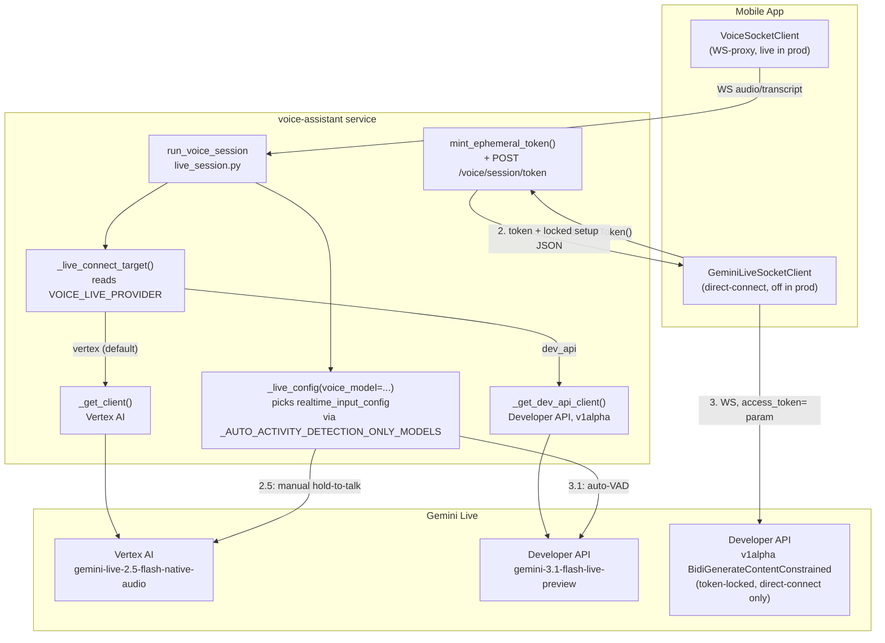
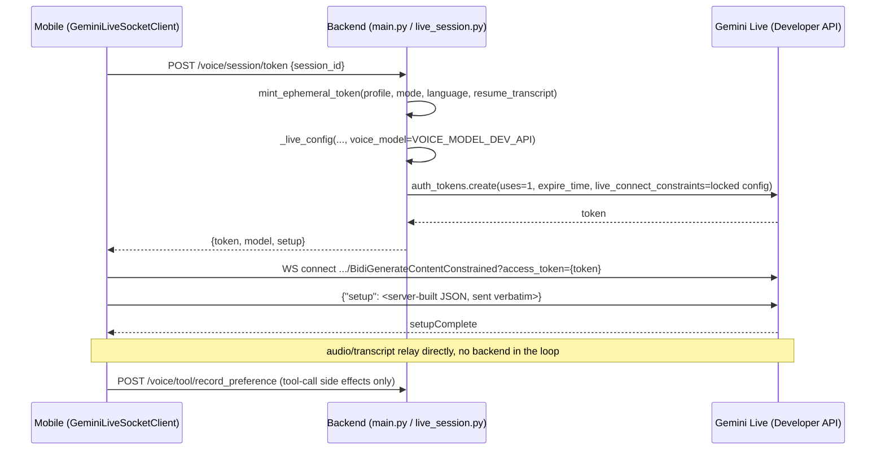

# Voice Assistant — Gemini Live Model Switch (2.5 → 3.1) & Ephemeral Tokens

Covers two related changes landed together on `feature/ephemeral-token` (commit `c11283e`,
`bijalm`, 2026-07-13): (1) a config-driven way to run the voice assistant's live session on
`gemini-3.1-flash-live-preview` instead of `gemini-live-2.5-flash-native-audio`, and (2) wiring
the mobile direct-connect transport up to the ephemeral-token minting endpoint that already
existed server-side but nothing was calling. They're covered together because the second was
originally scoped independently, but both needed the same Developer-API client machinery, and
testing the first is what surfaced a real compatibility bug that the fix now handles for both.

## 1. What it is (plain English)

The voice assistant talks to Google's Gemini Live model to hold a spoken conversation with the
shopper. This model can now be switched — via one environment variable, no code redeploy — between
the previous model (2.5) and a newer one (3.1), so the team can test the newer model in the dev
environment before trusting it in production, and instantly fall back if it misbehaves.

Separately, the mobile app has an optional "talk directly to Google, skip our server" mode
(currently switched off for everyone). It used to authenticate that connection with one password
baked permanently into the app. It now asks the backend for a temporary, one-time pass instead —
so if someone ever took the app apart, there's no permanent secret to find.

## 2. Business value

- **De-risked model upgrades**: Gemini model versions change fairly often (2.5 → 3.1 already
  happened once). Without this switch, testing a new model meant either committing to it in
  production or running a whole separate deployment. Now it's one environment variable
  (`VOICE_LIVE_PROVIDER`), testable in `shoplens2026-dev`, revertible in seconds.
- **Avoids being stuck when a newer model launches Developer-API-only**: `gemini-3.1-flash-live-preview`
  is not available on Vertex AI at all as of this writing (confirmed via a live `client.models.list()`
  call against the Developer API during this work) — only through the Gemini Developer API (the same
  API AI Studio uses). Without this change, the only way to use a preview-only model would have been
  waiting for Vertex AI availability, with no ETA.
- **Closes a real security gap before it ships to users**: the direct-connect mobile transport is
  still switched off in production, but the code already existed for it. Its original design used a
  static, non-expiring API key embedded in the mobile build — the code's own comment called this "an
  accepted tradeoff." A decompiled APK/IPA would expose that key forever, with no way to revoke just
  one installed copy. Ephemeral tokens (short-lived, single-conversation, and locked to the exact
  prompt/tools the backend built) close that gap — and it's done now, while the feature is still off,
  instead of shipping the risky version to real users first and fixing it under pressure later.

## 3. Functional importance

- **What depends on it**: every voice session today (the model switch — currently defaulted to the
  safe/existing 2.5 model in production, but toggled to 3.1 in `shoplens2026-dev` for active testing).
  The ephemeral-token flow only matters once the direct-connect transport is turned on — not live for
  any real user yet.
- **What breaks if it's misconfigured**: if `VOICE_LIVE_PROVIDER=dev_api` is set without
  `AI_STUDIO_API_KEY` also configured, the live session fails to connect (`_get_dev_api_client()`
  raises `RuntimeError: AI_STUDIO_API_KEY not set`) — session start fails cleanly rather than
  silently misbehaving. If `VOICE_MODEL_DEV_API` is pointed at a model not in
  `_AUTO_ACTIVITY_DETECTION_ONLY_MODELS` but that model *also* rejects the manual hold-to-talk
  combination (see §4), the same `1007 Precondition check failed` bug this change fixed for 3.1
  would resurface silently for that model — this fix is allow-listed by model string, not automatic.
- **What this specifically had to handle**: a live-tested, reproducible incompatibility between
  3.1 and the app's existing turn-taking design (§4) — not a hypothetical risk, an actual `1007`
  WebSocket close confirmed against the real API before the fix was written.

## 4. Technical insights

### 4a. The model/provider switch

**File**: `services/voice-assistant/live_session.py`

Two Gemini clients already existed before this change, for different auth models:
- `_get_client()` (Vertex AI, ADC/service-account auth) — used for the live session by default, and
  unconditionally for the separate, cheap text-extraction call (`_extract_patch_from_transcript`,
  a different model entirely, unaffected by any of this).
- `_get_dev_api_client()` (Developer API / AI Studio key auth, `api_version="v1alpha"`) — previously
  used *only* to mint ephemeral tokens (`client.auth_tokens.create()` raises `ValueError` on a Vertex
  AI client, hence the split).

The new piece is `_live_connect_target()` (`live_session.py:711`), which picks between them for the
live session itself:

```python
_VOICE_LIVE_PROVIDER = os.environ.get("VOICE_LIVE_PROVIDER", "vertex").lower()  # live_session.py:50

def _live_connect_target() -> tuple[genai.Client, str]:
    if _VOICE_LIVE_PROVIDER == "dev_api":
        return _get_dev_api_client(), _VOICE_MODEL_DEV_API
    return _get_client(), _VOICE_MODEL
```

`run_voice_session` calls this instead of `_get_client()` directly, and passes the resolved
`voice_model` into both `client.aio.live.connect(model=voice_model, ...)` and `_live_config(...)`.
`_VOICE_MODEL_DEV_API` (already existed, previously only used for token-minting) becomes
dual-purpose: it's now also what the live session uses when `VOICE_LIVE_PROVIDER=dev_api`. Two
independent levers, useful for testing in isolation, but meant to move together for any real cutover.

### 4b. The bug this surfaced: manual turn-taking breaks on 3.1

`_live_config()` (`live_session.py:648`) builds the full `LiveConnectConfig` — tools, system prompt,
voice, transcription, and critically, `realtime_input_config`. The existing design disables Gemini's
own voice-activity detection (`automatic_activity_detection.disabled=True`) because it was
"unreliable over the resampled/web-captured mic audio" — instead, the mobile hold-to-talk button
drives turn boundaries explicitly, sending `speech_start`/`speech_end` control frames that the
backend translates into `activity_start`/`activity_end` realtime-input messages
(`_pump_client_to_gemini`).

Live-tested against the real Developer API during this work (isolated Python scripts, not
committed — see the plan history in `docs/explainer/`): connecting to `gemini-3.1-flash-live-preview`
with `automatic_activity_detection.disabled=True` and then sending `activity_start`/`activity_end`
closes the connection with `1007 (invalid frame payload data) Precondition check failed` on the very
first turn. Bisected precisely:
- `disabled=True` alone (no activity markers sent): works.
- Activity markers alone (detection left at its default, enabled): works.
- **Both together**: fails, reproducibly, only on 3.1 — the same combination works fine on the
  current 2.5 model.

The fix, `_AUTO_ACTIVITY_DETECTION_ONLY_MODELS` (`live_session.py:642`):

```python
_AUTO_ACTIVITY_DETECTION_ONLY_MODELS = frozenset({
    "gemini-3.1-flash-live-preview",
    "models/gemini-3.1-flash-live-preview",
})
```

`_live_config` now takes a `voice_model` parameter; for any model in that set,
`realtime_input_config` is left `None` entirely (Gemini's own detection stays on) instead of
building the `disabled=True` config. The mobile client's hold-to-talk button still sends its
`speech_start`/`speech_end` frames unchanged — they're harmless but redundant once Gemini is doing
its own detection.

A follow-up live test (full real `_live_config`, auto-detection on, three sequential
text-simulated turns including a compound preference statement) completed cleanly with no 1007s,
and the `record_preference` tool's `NON_BLOCKING`/`SILENT` behavior — a separate documented 3.1 risk
(3.1's docs note async/non-blocking function calling is removed) — produced one coherent
acknowledgement for three tool calls in one turn, not three separate ones. **Caveat that matters**:
this was validated via text-simulated input, not real microphone audio — whether Gemini's own VAD is
actually reliable on this app's real audio path (the exact question that got manual control built in
the first place) is still an open, real-device-only question. See §7.

### 4c. Ephemeral tokens for the direct-connect transport

**Files**: `services/voice-assistant/live_session.py` (`mint_ephemeral_token`, line 769),
`services/voice-assistant/main.py` (`mint_session_token`, line 473),
`mobile/lib/data/sources/remote/gemini_live_socket_client.dart`.

`mint_ephemeral_token()` was already fully built and unit-tested before this change — it calls
`client.auth_tokens.create()` on the Developer-API client with:
- `uses=1` — single-session.
- `expire_time` / `new_session_expire_time` — short-lived (`_TOKEN_EXPIRE_SECONDS`,
  `_TOKEN_NEW_SESSION_EXPIRE_SECONDS`).
- `live_connect_constraints=LiveConnectConstraints(model=..., config=live_config)` with
  `lock_additional_fields=[]` — locks *every* field in the server-built `LiveConnectConfig`, so a
  client holding the token can't override the system prompt, tools, or voice even if it tried.

It returns `{"token": ..., "model": ..., "setup": ...}` — `setup` being the exact wire-format JSON
(built via a private SDK converter, `_build_setup_json`) the client should send as its first frame.
`POST /voice/session/token` (`main.py`) exposes this over REST, behind Firebase auth + session
ownership.

What changed: previously nothing on the mobile side called this. `GeminiLiveSocketClient.connect()`
used a static `AI_STUDIO_API_KEY` dart-define, sent as an `x-goog-api-key` header, against the plain
`v1beta...BidiGenerateContent` endpoint, building its own `setup` JSON client-side via a ~250-line
hand-port of the backend's prompt/tool logic (`gemini_live_setup_builder.dart`). Now it:

1. Calls `_voiceApi.mintToken(sessionId)` (`gemini_live_socket_client.dart:186`) — already existed
   in `voice_api.dart`, previously unused.
2. Connects to the token-locked endpoint variant instead:
   `wss://.../v1alpha.GenerativeService.BidiGenerateContentConstrained?access_token={token}`
   (`gemini_live_socket_client.dart:194`) — note this requires `v1alpha` and the `Constrained`
   endpoint suffix specifically; the plain endpoint doesn't accept ephemeral tokens.
2. Sends `tokenResponse.setup` verbatim as the first frame instead of building it locally.

No static key ships in the mobile build anymore (`ApiConstants.aiStudioApiKey` and the corresponding
`codemagic.yaml` dart-define/guard were deleted). `gemini_live_setup_builder.dart` shrank from a full
prompt/tool port down to just the greeting-cue text (`greetingCue`, `kFreshGreetingCue`,
`kResumeGreetingCue`) — the one thing genuinely still needed client-side, since the greeting trigger
is a separate `realtimeInput` message sent *after* setup completes, not part of `setup` itself. A
real gap was fixed along the way: `mint_ephemeral_token` didn't accept `resume_transcript`, so a
reconnect on this transport would have minted a token locked to a system prompt with no memory of
the prior conversation — now threaded through from `main.py`'s `session.transcript`.

### Config knobs

| Var | Where | Purpose |
|---|---|---|
| `VOICE_LIVE_PROVIDER` | backend, `.env.example` | `vertex` (default) or `dev_api` — which client/model the live session connects with |
| `VOICE_MODEL_DEV_API` | backend, `.env.example` | Developer-API model id — dual-purpose: token-minting *and* the live session when `VOICE_LIVE_PROVIDER=dev_api` |
| `AI_STUDIO_API_KEY` | backend only now (removed from mobile dart-define) | Developer-API key backing both uses above |

## 5. Architecture

Two independent things share the same underlying Developer-API client machinery:

- **Model switch** — affects the WS-proxy transport (the only one live in production). Mobile
  streams audio to the backend as always; the backend now picks Vertex+2.5 or Developer-API+3.1
  before opening the Gemini Live session, transparently to the client.
- **Ephemeral tokens** — affects only the direct-connect transport (off in production). Mobile calls
  the backend once (HTTPS, `POST /voice/session/token`) to get a token + setup JSON, then talks to
  Gemini directly over WebSocket for the rest of the session; tool-call side effects still route
  through the backend either way.



Sequence for the ephemeral-token flow specifically:



## 6. Config-driven cutover in practice (this session)

To validate this before touching production, the change was deployed to `shoplens2026-dev`
(`gcloud run deploy --source services/voice-assistant`, since the usual deploy script's vault-file
check failed in this environment) and the model verified live: `client.models.list()` against the
real Developer API confirmed `models/gemini-3.1-flash-live-preview` (`supported_actions:
['bidiGenerateContent']`) is the correct id. `VOICE_LIVE_PROVIDER=dev_api` +
`VOICE_MODEL_DEV_API=models/gemini-3.1-flash-live-preview` were set via `gcloud run services update
--update-env-vars` (no redeploy needed) — the same mechanism reverts it instantly if needed.

## 7. Recent history / open questions

- **Landed in commit `c11283e`** (`bijalm`, 2026-07-13, branch `feature/ephemeral-token`) — this is
  the commit that introduced everything described above.
- **Still open: real-device audio reliability of auto-VAD on 3.1.** Everything validated so far used
  text-simulated turns against the real API, which proves the config/protocol combination is
  accepted and functions correctly, but says nothing about whether Gemini's own activity detection
  is actually reliable on this app's real resampled/web-captured mic audio — the exact failure mode
  that got manual hold-to-talk control built for the 2.5 architecture in the first place. This is the
  live gate before trusting 3.1 in production; `shoplens2026-dev` is currently configured for this
  test.
- **The `record_preference`/`NON_BLOCKING` risk looked fine but isn't conclusively cleared.** One
  live run showed correct behavior (one coherent acknowledgement for three tool calls), but that's a
  single sample via text input, not a robust test — worth deliberate re-verification once real
  conversations are being tested.
- **`_AUTO_ACTIVITY_DETECTION_ONLY_MODELS` is an allow-list, not automatic detection** — a future
  model that has the same manual-activity-control incompatibility won't get this fix unless someone
  adds it to the set (see §3).
- **Related, resolved by this same change**: `docs/explainer/voice-assistant-websocket-transport.md`
  previously flagged the ephemeral-token endpoint as built-but-unused by mobile as an open question —
  that's now resolved (§4c) and that doc has been updated accordingly.
