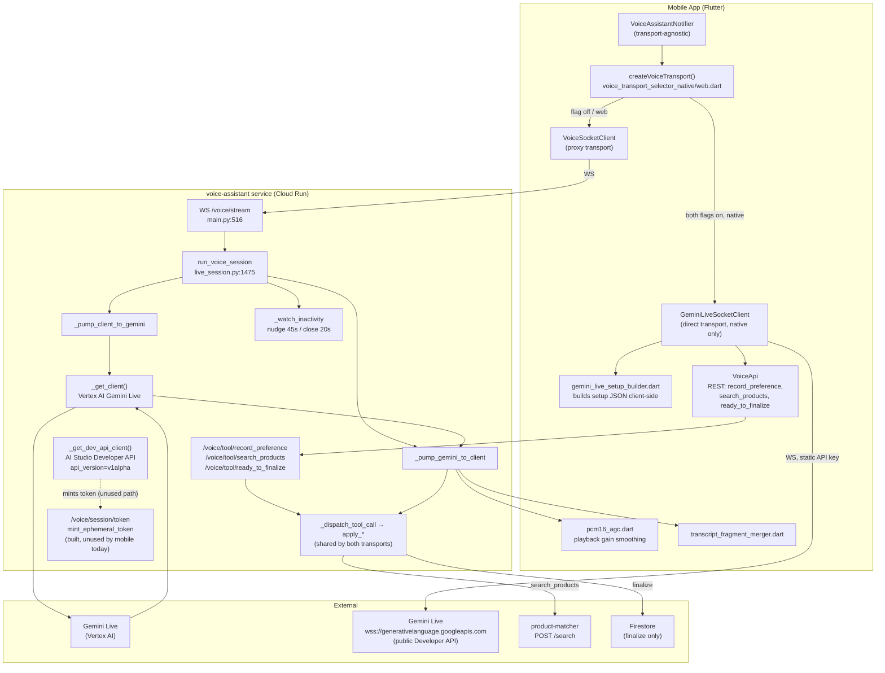

# Voice Assistant — Dual WebSocket Transport (Direct-Connect vs. Backend Proxy)

Covers the transport rework merged into `develop` from `feature/voice-chat-fix` (PR #3, commits
`2e7c770`..`9e19f0a`, merged as `9e19f0a`). This is about **how the mobile app's voice conversation
audio reaches Gemini**, not the voice assistant's conversational behavior itself.

## 1. What it is (plain English)

The voice assistant lets a shopper talk to the app instead of typing. Their speech has to travel
somewhere that can understand it (Google's Gemini Live model) and talk back in a synthesized voice.
Until now, that always happened through a relay: phone → our server → Google → our server → phone.

This change adds a second, optional route: phone → Google directly, cutting our server out of the
audio path entirely. Our server still handles the parts that must stay under our control — saving
learned preferences, running product searches, and now also acting as bank-vault security for the
new route (Google requires the request to prove who it's coming from, and our server is the one
that stamps that proof). Both routes are live in the code; which one a given user gets is controlled
by two independent switches, one of which is currently off, so **the direct route isn't reaching
production users yet.**

## 2. Business value

- **Latency and cost**: every voice turn currently makes two network hops through our own Cloud Run
  service (mobile → `voice-assistant` → Gemini, then back). Removing our server from the audio path
  removes one hop's latency and removes `voice-assistant`'s own compute/bandwidth cost for the audio
  stream itself (session-management and tool calls still run there). For a voice product, shaving
  round-trip latency directly affects how natural the conversation feels — a laggy voice assistant
  reads as broken, not just slow.
- **Resilience against our own backend**: if `voice-assistant` (Cloud Run) has an incident, a user on
  the direct-connect transport keeps talking to Gemini uninterrupted for session setup — only the
  side-effect calls (saving preferences, searching products) would be affected, not the conversation
  itself.
- **Tradeoff being made deliberately, not accidentally**: the direct path authenticates with a static
  API key embedded in the mobile build (`ApiConstants.aiStudioApiKey`,
  `mobile/lib/core/constants/api_constants.dart:47-52`) instead of the short-lived, config-locked
  ephemeral token the backend already knows how to mint (`mint_ephemeral_token`,
  `services/voice-assistant/live_session.py:654`). The code's own comment
  (`gemini_live_socket_client.dart:33-36`) states this outright: a decompiled build exposes this key
  with no expiry, "an accepted tradeoff" for shipping something simpler first. This is a real security
  posture decision a stakeholder should be aware of, not a bug — see §7.
- **Staged rollout, not a flip of a switch**: two independent gates (a mobile build-time flag and a
  server-side flag) mean this can be turned on gradually and killed instantly fleet-wide if it
  misbehaves in production, without an app-store release. That's a meaningful de-risking of what is
  otherwise a fairly large architectural change.

## 3. Functional importance

- **What depends on it**: the entire live voice conversation (audio in, synthesized speech out,
  live transcripts) — this is the transport layer underneath every voice session, native or web.
- **What breaks if it's misconfigured**: nothing user-visible today — the server-side kill switch
  (`VOICE_DIRECT_CONNECT_ENABLED`, default `false`, `services/voice-assistant/.env.example`) means
  every session currently falls back to the pre-existing backend-proxy transport regardless of what
  a given mobile build was compiled with. The direct path is present in the codebase but not yet
  exposed to real traffic.
- **Platform-specific behavior it must handle**: web can never use the direct path — browsers cannot
  set custom auth headers on a WebSocket handshake (a W3C spec limitation), which this transport's
  auth model requires (`voice_transport_selector_web.dart:1-13`). So the abstraction has to support
  "always proxy on web, conditionally direct on native" as a first-class case, not an edge case.
  There's also no mock/dev-testing equivalent of the direct path (`VOICE_ASSISTANT_MOCK_GEMINI` only
  exists in the backend-proxy code path), so it can't be exercised in the same low-cost way the proxy
  path can during development.
- **Idle/inactivity handling had to be re-implemented, not just relayed**: on the proxy path, the
  *backend* watches for silence and nudges/auto-saves/closes the session
  (`_watch_inactivity`, `live_session.py:1444`). On the direct path, the backend never sees the live
  session at all, so the exact same timing constants are duplicated client-side and the same
  nudge/close logic runs in Dart (`gemini_live_socket_client.dart:15-20`, its own idle timer at
  line ~80). This is a real behavioral fork that has to be kept in sync by hand if those constants
  ever change.

## 4. Technical insights

**The abstraction.** `VoiceTransport` (`mobile/lib/data/sources/remote/voice_transport.dart:47`) is a
shared interface (`connect`, `sendAudio`, `sendText`, `sendSpeechStart/End`, `close`, `dispose`, and a
`frames` stream of `VoiceAudioFrame | VoiceControlFrame | VoiceSocketClosed`). `VoiceAssistantNotifier`
(`mobile/lib/presentation/providers/voice_assistant_provider.dart`) is fully transport-agnostic — no
transport-specific branching anywhere in the provider; the abstraction fully absorbs the difference.

**Selection — two independent gates, both must be true** (`voice_transport_selector_native.dart:6-19`):
```dart
(directConnectAllowed && ApiConstants.voiceDirectConnectFlagEnabled)
    ? GeminiLiveSocketClient(voiceApi)
    : VoiceSocketClient();
```
- `ApiConstants.voiceDirectConnectFlagEnabled` — compile-time dart-define (`VOICE_DIRECT_CONNECT_ENABLED`,
  `api_constants.dart:44-45`), default `false`. Needs a rebuild to flip — this is the staged-rollout
  lever.
- `directConnectAllowed` — a runtime flag the *server* returns in `/voice/session/start`'s response
  (`services/voice-assistant/main.py:184`, sourced from the same-named server env var). This is the
  instant, fleet-wide kill switch — no app release needed to shut it off.
- Web (`voice_transport_selector_web.dart`) ignores both inputs and always returns the proxy transport.

**Where audio actually goes on the direct path.** `GeminiLiveSocketClient` opens a raw WebSocket
straight to Google's public endpoint:
```
wss://generativelanguage.googleapis.com/ws/google.ai.generativelanguage.v1beta.GenerativeService.BidiGenerateContent
```
(`gemini_live_socket_client.dart:63-64`), authenticated via header `x-goog-api-key` with the static
`aiStudioApiKey` (lines 67, 124), using `dart:io`'s `WebSocket.connect(..., headers: {...})` — the very
capability web lacks. It builds its own session-setup JSON client-side
(`gemini_live_setup_builder.dart`), explicitly ported from the backend's equivalent
(`live_session.py`'s `_build_setup_json`) so a direct-connect session doesn't need a backend call to
start at all. Tool-call *side effects* — `record_preference`, `search_products`, `ready_to_finalize` —
still go through backend REST endpoints via `VoiceApi` (`voice_api.dart:69-94`), because Firestore
writes and the Shopping/Amazon search must stay server-side. Only the audio/transcript/session-setup
relay moved off the backend.

**The backend's matching half.** `_get_dev_api_client()` (`live_session.py:597`) is a *second*,
separate Gemini client from the one used for the proxy path (`_get_client()`, line 557, Vertex
AI-backed) — ephemeral-token minting (`client.auth_tokens.create`) unconditionally raises `ValueError`
on a Vertex AI client, so a distinct Developer-API client, authenticated with `AI_STUDIO_API_KEY` and
pinned to `api_version="v1alpha"` (tokens are experimental/v1alpha-only), had to be added
(`live_session.py:597-609`). `mint_ephemeral_token` (line 654) and the `/voice/session/token` endpoint
(`main.py:408-425`) implement this — **but `GeminiLiveSocketClient` never calls it.** A grep across
`mobile/` confirms zero call sites for `VoiceApi.mintToken()`. The code's own doc comment
(`gemini_live_socket_client.dart:29-39`) says as much: "no backend call, no ephemeral token." This
looks like an earlier planned design (ephemeral, backend-minted, config-locked tokens) that was
superseded mid-build by the simpler static-key approach, leaving the mint endpoint as unused
scaffolding on the mobile side. **Worth a direct question to whoever's driving this feature**: is
`/voice/session/token` meant to be wired up before this reaches real users, or intentionally deferred?
Given the security tradeoff called out in §2, this isn't cosmetic.

`_build_setup_json` also reaches into a **private** SDK module (`google.genai._live_converters`) to
produce the exact wire format the mobile client replays — `google-genai` is pinned to exactly `2.9.0`
(not `>=`) in `requirements.txt` specifically because this coupling could silently break on an SDK
upgrade.

**Two smaller but real audio-quality fixes shipped alongside the transport work:**
- `pcm16_agc.dart` (140 lines, new) — automatic gain control smoothing applied to Gemini's synthesized
  speech before playback, because loudness varies noticeably turn to turn. RMS-based (not peak),
  per-turn calibration window (`calibrationBudgetMs=100ms`, capped by `silenceFallbackMs=450ms`),
  asymmetric attack/release (fast cut at `attack=0.5` when too loud, slow boost at `release=0.03` when
  quiet, targeting `targetPeak=0.55`), gain clamped `[0.4, 4.0]` plus a hard per-chunk clip-safety
  clamp. Gain intentionally carries across turns rather than resetting, so consecutive turns converge
  to one volume. Wired into playback at `voice_assistant_provider.dart:476`.
- `transcript_fragment_merger.dart` (19 lines, new) — `mergeTranscriptFragment(current, incoming)`
  stitches Gemini's streamed transcript fragments, which arrive with no reliable `finished` boundary
  marker and can be prefix-repeats, exact repeats, or true continuations. It checks prefix/suffix
  containment and splices past the longest overlap, falling back to plain concatenation.

**Config knobs added:**
| Var | Where | Default | Purpose |
|---|---|---|---|
| `VOICE_DIRECT_CONNECT_ENABLED` | backend `.env.example` | `false` | Server-side kill switch, returned to client as `direct_connect_allowed` |
| `AI_STUDIO_API_KEY` | backend `.env.example` + mobile dart-define | — | Developer-API key: backend uses it to mint ephemeral tokens (unused path, see above); mobile uses it directly as the static auth key |
| `VOICE_MODEL_DEV_API` | backend `.env.example` | `models/gemini-2.5-flash-native-audio-latest` | Developer-API model id (different id format than the Vertex AI `VOICE_MODEL`) |
| `VOICE_DIRECT_CONNECT_ENABLED` (dart-define) | mobile build | `false` | Compile-time gate, `api_constants.dart:44-45` |

`codemagic.yaml` now passes both `VOICE_DIRECT_CONNECT_ENABLED` and `AI_STUDIO_API_KEY` as build-time
dart-defines for iOS/Android CI builds, with the Codemagic variable group renamed
`firebase-cookshop` → `firebase-2026` and hard `${VAR:?ERROR}` guards that fail the build fast if
either is missing.

**A real bug fixed in this same window** (`main.py:279-284`, commit `1e5d92f`): resuming a session
previously reset `language` to `"English"` unconditionally on every `/voice/session/start` call —
silently discarding a resumed non-English session's language. Now it only overwrites `language` if the
client explicitly passes a different, recognized `SUPPORTED_LANGUAGES` value.

## 5. Architecture

Two parallel paths, converging on the same backend for tool-call side effects and session
bookkeeping:

- **Proxy path (default, live in production today):** mobile `VoiceSocketClient` → our
  `voice-assistant` Cloud Run WebSocket (`main.py:516 voice_stream`) → `run_voice_session`
  (`live_session.py:1475`) opens a Vertex AI Gemini Live session and pumps both directions
  (`_pump_client_to_gemini`/`_pump_gemini_to_client`) → tool calls dispatch through shared `apply_*`
  functions (`live_session.py:859-947`) → `product-matcher` for `search_products` → Firestore on
  finalize.
- **Direct-connect path (built, not yet enabled for real traffic):** mobile
  `GeminiLiveSocketClient` → straight to Google's public Gemini Live WS endpoint (Developer API,
  static key auth) for audio/transcript/setup. Tool-call side effects still route to the same backend
  REST endpoints (`/voice/tool/record_preference`, `/voice/tool/search_products`,
  `/voice/tool/ready_to_finalize`) and the same `apply_*` functions — so side-effect logic has exactly
  one implementation regardless of transport (explicit design intent per `_dispatch_tool_call`'s
  docstring, `live_session.py:950-955`).

Both paths share the same in-memory `SessionRegistry` (`live_session.py:512`, no Firestore
persistence, `SESSION_MAX_SECONDS=600s` cap, `DISCONNECT_GRACE_SECONDS=120s` for resume) and the same
`product-matcher` search interface (`POST /search`, 25s client timeout, results clamped to 1-15).



## 6. Recent history / open questions

- **`2e7c770` "Added websocket + API key fix"** is the real foundational commit — introduced
  `gemini_live_setup_builder.dart`, most of `gemini_live_socket_client.dart`/`voice_transport.dart`,
  and the matching backend dual-client/ephemeral-token code. The "API key fix" in the title refers to
  the architectural need for a second, Developer-API-authenticated Gemini client (§4), not a small
  typo fix.
- **`831e5fd` "Fix bugs"** bundles a rewrite of `pcm16_agc.dart`'s calibration/attack-release design
  together with unrelated `product-matcher` work (Amazon-combined-search + thumbnail-validity
  filtering) in the same commit — worth knowing if you're trying to `git revert` one without the
  other.
- The remaining "Fix bugs"/"Fixed bugs" commits (`50185fc`, `3cc77cd`, `64bf9eb`, `7fb3ff6`,
  `3f43fa0`) were not individually diffed in this pass — their titles don't indicate scope.
- **`docs/diagrams/voice-diagrams.md` is now stale** — it documents only the original single-transport,
  backend-proxied design and has zero mention of direct-connect, the two-gate flag, or ephemeral
  tokens. Anyone onboarding from that doc alone would miss this entire rework.
- **Unverified in production**: the direct-connect endpoint itself
  (`gemini_live_socket_client.dart:60-64`) is annotated "not yet spike-tested live — verify on first
  real connection," and a Phase-0 spike comment in `live_session.py:75-81` says whether
  `_TOKEN_EXPIRE_SECONDS` bounds session lifetime vs. just connection-opening is unverified against a
  live session (blocked on an AI Studio billing issue at the time). Both flags are consistent with the
  server kill switch defaulting to `false` — this looks like code that's built and unit-tested but not
  yet exercised against real Gemini traffic.
- **Ephemeral-token endpoint appears unused by mobile** (§4) — flag this explicitly to the feature
  owner before enabling `VOICE_DIRECT_CONNECT_ENABLED` in any real environment, since it changes the
  security posture described in §2 from "planned" to "shipped as-is."
- **Known, pre-existing drift not fixed here**: `_CLOSING_PHRASES` (`live_session.py:1206`) is
  duplicated by hand in `voice_assistant_provider.dart`'s `_isClosingPhrase` — no shared source of
  truth. A dead `if False and ...` branch also remains in `_watch_inactivity`
  (`live_session.py:1457`), looking like disabled debug code rather than intentional logic.
